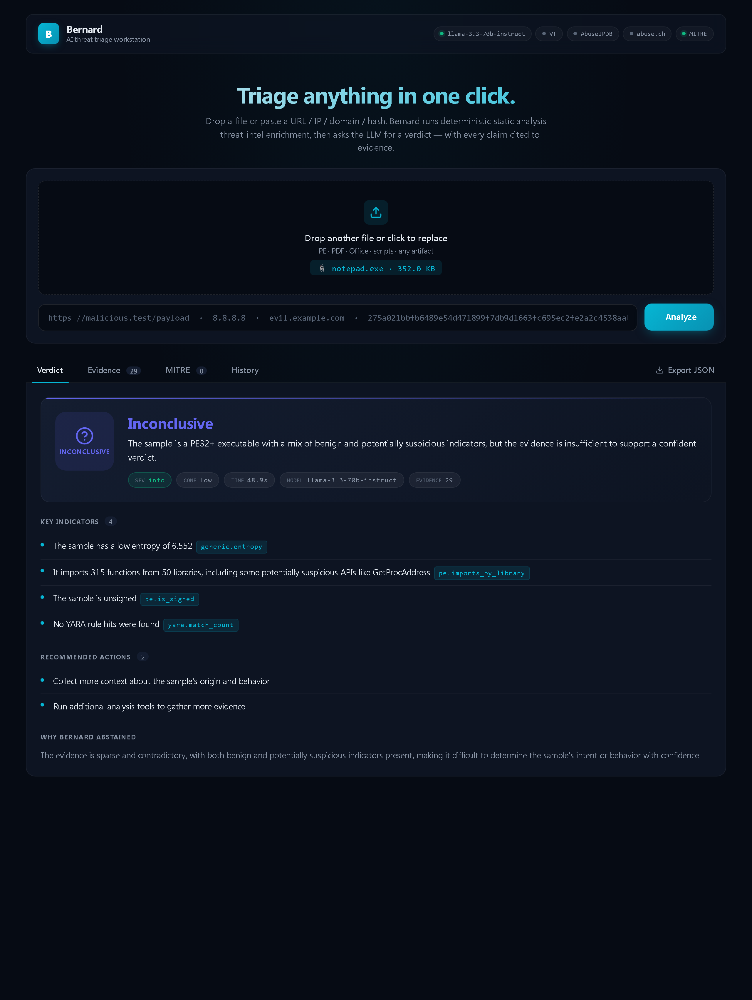

<div align="center">

# Bernard

### Self-Hosted AI Threat Triage Workstation

**Drop a file. Paste a URL. Get a verdict with every claim cited to evidence.**

[](LICENSE)
[](https://github.com/Jinish2170/BenardAI/releases)
[](https://www.python.org)
[](https://fastapi.tiangolo.com)
[](https://react.dev)
[](https://build.nvidia.com)
[](https://attack.mitre.org/)
[](#contributing)

[**Quick Start**](#-quick-start) · [**How it works**](#-how-it-works) · [**API**](#-api) · [**Architecture**](#-architecture) · [**Roadmap**](#-roadmap)

</div>

---

## Overview

**Bernard** is a self-hosted threat-triage workstation built on a simple discipline: **deterministic analyzers gather evidence first, then an LLM synthesizes a verdict that must cite that evidence.** No black-box scoring, no hallucinated CVE numbers, no orphan MITRE technique claims.

Hand it a file, URL, IP, domain, or hash. Bernard runs static analysis (LIEF for PE, oletools for Office, pdfid for PDF, YARA-X with YARA-Forge rules), enriches with threat intel (VirusTotal, abuse.ch URLhaus / ThreatFox / MalwareBazaar, AbuseIPDB), and asks the LLM (NVIDIA NIM Llama 3.3 70B by default) for a verdict — with strict citation anchoring, MITRE ATT&CK mapping, and explicit abstention when evidence is thin.

```
VirusTotal    → multi-engine verdict, no reasoning, paid for serious use
Joe Sandbox   → deep behavioral analysis, $$$$, requires a sample upload to a 3rd party
Cuckoo / CAPE → great sandboxing, heavy infra, no verdict synthesis
Bernard       → static + intel + LLM synthesis with auditable citations, on your machine, free
```

---

## 📸 Dashboard

<div align="center">



*Live analysis of a Windows PE. Sticky glass topbar shows the configured LLM model + a color-coded status chip per intel provider (VT · AbuseIPDB · abuse.ch · MITRE). Drag-and-drop file zone, large semantic verdict badge (skull / warn / check / help by classification), meta pills (Sev · Conf · Time · Model · Evidence count), citation pills like `[pe.suspicious_imports]` that map back to actual evidence rows, and a "Why Bernard abstained" section when the LLM correctly refused to guess.*

</div>

### What you can do in the UI

| | |
|---|---|
| 🎯 **Drag-and-drop file zone** | Drop any artifact (PE, PDF, Office, script…) or click to choose. Real-time file chip preview. |
| 🔤 **Smart text input** | Paste a URL, IP, domain, or hash — Bernard auto-detects the kind. |
| 🎨 **Verdict hero card** | Large badge with classification icon, gradient accent tinted by severity, summary, plus a meta-pill strip for at-a-glance review |
| 🔗 **Citation pills** | Every `[analyzer.field]` token in a key indicator renders as a tooltipped pill — click-through to the matching evidence row |
| 📂 **Evidence grouped by analyzer** | Collapsible group cards (pe / pdf / yara / virustotal / …) with a max-severity badge per group |
| 🛰 **MITRE chip → detail card** | Click any technique chip and Bernard fetches the official ATT&CK description, tactic tags, and `attack.mitre.org` link on demand |
| 📡 **Streaming progress** | Each pipeline phase (search → analyze → enrich → triage) streams live via NDJSON; the latest phase pulses |
| 🗂 **History tab** | Past analyses persisted to disk, click any row to reopen the full record |
| ⬇ **Export JSON** | One click downloads the full record (evidence + verdict + stats) for offline review or pipeline ingestion |
| ✨ **Polish** | Sticky glass topbar, JetBrains Mono for citations, fade-in animations, responsive `<720px` layout |

---

## ✨ What it does

| | |
|---|---|
| 📦 **PE static analysis** | LIEF parses headers, sections, imports, signing, overlay; flags suspicious API combinations (process injection, anti-debug, persistence) and high-entropy sections (packing) |
| 📑 **PDF analysis** | pdfid-style keyword counting (`/JS`, `/JavaScript`, `/OpenAction`, `/Launch`, `/EmbeddedFile`); dropper heuristic flags short PDFs with active content |
| 📄 **Office macro analysis** | oletools (`olevba`) extracts macros, runs AutoExec/Suspicious keyword scanner, surfaces IOCs from VBA |
| 🔬 **Generic file features** | SHA-256/SHA-1/MD5, Shannon entropy, printable strings, embedded URL/IP extraction, suspicious-token heuristics |
| 🐝 **YARA-X scanning** | The new Rust-rewrite of YARA (2026 stable) with auto-bootstrapped [YARA-Forge](https://yarahq.github.io/) curated rules |
| 🌐 **Threat intel enrichment** | VirusTotal (hash / URL / IP), abuse.ch URLhaus + ThreatFox + MalwareBazaar, AbuseIPDB — all with graceful degradation when keys are missing |
| 🎯 **MITRE ATT&CK mapping** | LLM maps evidence to ATT&CK techniques; orphan/hallucinated technique IDs are dropped post-validation against the official STIX bundle |
| 🛡 **Citation anchoring** | Every key indicator and every MITRE technique cites the specific `[analyzer.field]` evidence that justifies it — hallucinated citations are rejected |
| 🤔 **Abstention over hallucination** | If evidence is sparse or contradictory, the verdict is `inconclusive` with an explicit reason — not a confident wrong answer |
| 🧪 **Prompt-injection defense** | Analyzer outputs are sanitized through a regex pass (strip control chars, redact `ignore previous instructions` patterns) before reaching the LLM |
| 💾 **Investigation history** | Every analysis persists to `analyses/YYYY-MM-DD/` — full evidence + verdict, exportable as JSON |
| 🖥 **Web dashboard** | React + Vite UI with verdict cards, evidence audit table, MITRE chips, streaming progress over NDJSON, history tab, export |
| 🔌 **REST + streaming API** | FastAPI with `/analyze`, `/analyze/stream` (NDJSON), `/analyses`, `/analysis/{id}` |
| ⌨ **CLI** | `bernard scan --file sample.exe` or `bernard scan --value http://...` |

---

## 🚀 Quick Start

### Prerequisites
- **Python 3.11+** (LIEF + yara-x need native wheels)
- **Node.js 20+** (for the dashboard)
- **NVIDIA NIM API key** (free at [build.nvidia.com](https://build.nvidia.com/)) — or any OpenAI-compatible provider

### Install

```bash
git clone https://github.com/Jinish2170/BenardAI.git
cd BenardAI

# Backend
pip install -e .

# Bootstrap MITRE ATT&CK catalog + YARA-Forge rules (one-time, ~55 MB total)
python scripts/bootstrap_mitre.py
python scripts/bootstrap_yara.py

# Frontend
cd frontend && npm install && cd ..

# Configure your LLM key
cp .env.example .env
#  → edit .env: paste NVIDIA NIM key into LLM_API_KEY
#    optional: VT_API_KEY, ABUSEIPDB_API_KEY, ABUSECH_API_KEY
```

### Run

```bash
# API on :3003 and dashboard on :3000 (recommended)
bernard serve &
cd frontend && npm run dev
```

Then open **http://localhost:3000** and drop a file or paste a URL/IP/domain/hash.

### CLI

```bash
bernard scan --file ./samples/suspicious.exe
bernard scan --value "https://example.com/payload.bin"
bernard scan --value "8.8.8.8"
bernard scan --value "275a021bbfb6489e54d471899f7db9d1663fc695ec2fe2a2c4538aabf651fd0f"
bernard scan --file sample.docm --json   # raw JSON for piping
```

---

## ⚙ Configuration

`.env` settings (see `.env.example`):

| Variable | Default | Purpose |
|----------|---------|---------|
| `LLM_API_KEY` | *(see auto-discovery below)* | API key for the LLM provider |
| `LLM_BASE_URL` | `https://integrate.api.nvidia.com/v1` | OpenAI-compatible endpoint |
| `LLM_MODEL` | `meta/llama-3.3-70b-instruct` | Model id at that endpoint |
| `VT_API_KEY` | *(optional)* | Enables VirusTotal hash/URL/IP lookups (free tier: 4 req/min) |
| `ABUSEIPDB_API_KEY` | *(optional)* | Enables AbuseIPDB IP reputation (free: 1000 req/day) |
| `ABUSECH_API_KEY` | *(optional)* | Enables URLhaus, ThreatFox, MalwareBazaar (free at [auth.abuse.ch](https://auth.abuse.ch/)) |
| `CCNIM_ENV` | *(optional)* | Override the auto-discovery path for the cc-nim env file |
| `PORT` | `3003` | API server port |
| `MAX_UPLOAD_MB` | `100` | Per-upload size cap |
| `ANALYSIS_TIMEOUT_S` | `120` | Per-analysis hard timeout |

### 🔑 NVIDIA NIM key auto-discovery

If `LLM_API_KEY` is empty, Bernard automatically resolves it from `NVIDIA_NIM_API_KEY` in your central [cc-nim](https://github.com/cc-nim/cc-nim) `.env`. Default lookup order:

1. `$CCNIM_ENV` (explicit override)
2. `C:\files\coding dev era\claude code\cc-nim\.env`
3. `~/cc-nim/.env`

That means you keep a single source of truth for the NVIDIA NIM key and Bernard picks it up without copying it around. Set `LLM_API_KEY` in `.env` to override.

### Alternate LLM providers

Any OpenAI-compatible endpoint works:

```env
# OpenRouter
LLM_BASE_URL=https://openrouter.ai/api/v1
LLM_MODEL=meta-llama/llama-3.3-70b-instruct:free

# Groq
LLM_BASE_URL=https://api.groq.com/openai/v1
LLM_MODEL=llama-3.3-70b-versatile

# Local Ollama
LLM_BASE_URL=http://localhost:11434/v1
LLM_MODEL=llama3.3
LLM_API_KEY=ollama
```

---

## 🔬 How it works

```
                        ┌──────────────────────────────────────────────────────────┐
                        │                  BERNARD PIPELINE                         │
                        └──────────────────────────────────────────────────────────┘

  input ──┬─→ file ──→  [PE]      [PDF]      [Office]    [Generic]    [YARA-X]   ─┐
          │                                                                       │
          ├─→ url  ─────────────────────────────────────────────────────────────  │
          ├─→ ip   ─────────────────────────────────────────────────────────────  ├─→ Evidence[]
          ├─→ domain ───────────────────────────────────────────────────────────  │
          └─→ hash ─────────────────────────────────────────────────────────────  │
                                                                                  │
                              ┌───────────────────────────────────────────────────┘
                              ↓
                       [Threat-intel enrichment]
                        VirusTotal · URLhaus · ThreatFox ·
                        MalwareBazaar · AbuseIPDB
                              ↓
                       [Sanitize for LLM]   ←  redact control chars,
                              ↓                  prompt-injection patterns
                       [NVIDIA NIM Llama 3.3 70B]
                              ↓
                       [Post-validate JSON]   ←  reject orphan citations
                              ↓                  reject unknown MITRE IDs
                       Verdict
                       (classification + severity + cited indicators
                        + grounded MITRE techniques + actions)
```

### Design principles

| Principle | Practice |
|-----------|----------|
| **Evidence first, LLM second** | The LLM never sees raw bytes from samples — only structured `Evidence` produced by deterministic analyzers. This is the citation contract that prevents hallucinated facts. |
| **Citations are mandatory** | Every `key_indicator` must end with `[analyzer.field]`. Citations that don't appear in actual evidence are dropped during validation. |
| **MITRE IDs are validated** | The LLM's claimed technique IDs are checked against the official ATT&CK STIX bundle. Unknown IDs are rejected, not displayed. |
| **Abstain over hallucinate** | The system prompt requires `classification: inconclusive` when evidence is sparse — and the LLM must explain *why*. |
| **Defang prompt injection** | All string fields are sanitized through a regex pass (strip control chars + redact known injection patterns) before reaching the LLM. |
| **Strict JSON output** | `response_format: json_object` enforces schema. The parser fails closed if the LLM emits invalid JSON. |

These rules are baked into both the system prompt (`src/bernard/triage/prompts.py`) and the post-validator (`src/bernard/triage/engine.py`).

---

## 📡 API

| Method | Path | Purpose |
|--------|------|---------|
| `GET`  | `/health` | Liveness + model + flags for `llm_configured` · `vt_configured` · `abuseipdb_configured` · `abusech_configured` · `mitre_loaded` (powers the dashboard's status chips) |
| `POST` | `/analyze` | Multipart `file=` OR form `value=...` (url/ip/domain/hash). Returns full record. |
| `POST` | `/analyze/stream` | Same payload, streams progress as NDJSON (`{event: "progress", data: {...}}`) followed by a final `{event: "result", data: AnalysisRecord}` |
| `GET`  | `/analyses?limit=50` | List past analyses (newest first) |
| `GET`  | `/analysis/{id}` | Load full past record |
| `GET`  | `/technique/{technique_id}` | MITRE ATT&CK technique metadata (name · description · tactics · `attack.mitre.org` URL) — used by the dashboard to render technique detail cards on demand |

### Example

```bash
curl -X POST http://localhost:3003/analyze \
  -F "file=@./suspect.exe"

curl -X POST http://localhost:3003/analyze \
  -F "value=https://example.com/payload"
```

### Verdict shape (excerpt)

```jsonc
{
  "id": "ana-...",
  "input":   { "kind": "file", "filename": "suspect.exe", "file_sha256": "..." },
  "evidence": [ /* Evidence[]: analyzer + field + value + severity + description */ ],
  "verdict": {
    "classification": "malicious",          // benign | suspicious | malicious | inconclusive
    "severity":       "high",               // info | low | medium | high | critical
    "confidence":     "high",
    "summary": "Sample is a packed Windows PE with extensive process-injection imports and a MalwareBazaar match...",
    "key_indicators": [
      "PE imports VirtualAllocEx + WriteProcessMemory + CreateRemoteThread — classic process-injection chain [pe.suspicious_imports]",
      "MalwareBazaar identifies this hash as AgentTesla [malwarebazaar.match]",
      "VirusTotal: 47/72 engines flag as malicious [virustotal.detection_ratio]"
    ],
    "mitre_techniques": [
      {
        "technique_id": "T1055",
        "name": "Process Injection",
        "rationale": "Imports VirtualAllocEx/WriteProcessMemory/CreateRemoteThread together — textbook process-hollowing primitive.",
        "cites": ["pe.suspicious_imports"]
      }
    ],
    "recommended_actions": ["Isolate host, capture memory, hunt for child process spawning"]
  },
  "stats": { "duration_ms": 24102, "evidence_count": 31, "llm_model": "meta/llama-3.3-70b-instruct" }
}
```

---

## 🏗 Architecture

```
BenardAI/
├── src/bernard/
│   ├── analyzers/
│   │   ├── base.py             FileAnalyzer/StringAnalyzer ABCs + safe-string sanitizer
│   │   ├── file/
│   │   │   ├── pe.py           LIEF: headers, imports, sections, signing, entropy
│   │   │   ├── pdf.py          PDFiD-style keyword counts + dropper heuristic
│   │   │   ├── office.py       oletools (olevba): VBA macros + IOC extraction
│   │   │   └── generic.py      hashes, entropy, strings, embedded URL/IP
│   │   └── yara_engine.py      YARA-X scanner over YARA-Forge ruleset
│   ├── intel/
│   │   ├── vt.py               VirusTotal (vt-py): file / URL / IP
│   │   ├── urlhaus.py          abuse.ch URLhaus
│   │   ├── threatfox.py        abuse.ch ThreatFox (IOC search)
│   │   ├── bazaar.py           abuse.ch MalwareBazaar (hash → family)
│   │   ├── abuseipdb.py        AbuseIPDB IP reputation
│   │   └── mitre.py            STIX-backed MITRE ATT&CK catalog (validator)
│   ├── triage/
│   │   ├── llm.py              OpenAI-compatible client (NVIDIA NIM by default)
│   │   ├── prompts.py          System + user prompts; JSON schema; citation rules
│   │   └── engine.py           Run + parse + post-validate (drop orphan citations, unknown MITRE IDs)
│   ├── orchestrator.py         Routes input → analyzers → intel → triage → record
│   ├── store.py                File-based AnalysisStore (analyses/YYYY-MM-DD/)
│   ├── api/server.py           FastAPI: REST + NDJSON streaming
│   ├── cli.py                  `bernard serve` and `bernard scan`
│   ├── config.py               Env-driven config (LLM, intel keys, server, storage)
│   └── types.py                Pydantic models (Evidence, Verdict, AnalysisRecord, …)
│
├── frontend/                   React + Vite dashboard (cyan/navy theme)
│   └── src/App.tsx             Verdict card · Evidence · MITRE · History
│
├── scripts/
│   ├── bootstrap_mitre.py      Download enterprise-attack STIX
│   └── bootstrap_yara.py       Download YARA-Forge core ruleset
│
├── rules/yara-forge/           YARA rules (gitignored, regenerable)
├── data/mitre-attack-stix/     ATT&CK STIX bundle (gitignored, regenerable)
├── analyses/                   Persisted analyses (gitignored)
└── uploads/                    Server-side upload staging (gitignored)
```

---

## 🛠 Commands

| Command | Purpose |
|---------|---------|
| `bernard serve` | Start the FastAPI server on `$PORT` (default 3003) |
| `bernard scan --file <path>` | Headless file scan; `--json` for raw JSON |
| `bernard scan --value <url\|ip\|domain\|hash>` | Headless IOC scan |
| `python scripts/bootstrap_mitre.py` | (Re)download MITRE STIX bundle |
| `python scripts/bootstrap_yara.py` | (Re)download YARA-Forge core ruleset |
| `cd frontend && npm run dev` | Dashboard dev server on `:3000` (proxies `/api` → `:3003`) |
| `cd frontend && npm run build` | Build production dashboard bundle |

---

## 🆚 How it compares

| | Bernard | VirusTotal | Joe Sandbox | Cuckoo / CAPE | Hand triage |
|---|:---:|:---:|:---:|:---:|:---:|
| Cited verdict (every claim → evidence) | ✅ | ❌ | ⚠️ | ❌ | ✅ |
| MITRE ATT&CK mapping (validated) | ✅ | ⚠️ | ✅ | ⚠️ | ✅ |
| Free / self-hosted | ✅ | ⚠️ | ❌ | ✅ | — |
| Open source | ✅ | ❌ | ❌ | ✅ | — |
| LLM synthesis with abstention | ✅ | ❌ | ⚠️ | ❌ | — |
| YARA-X (2026 Rust YARA) | ✅ | ✅ | ⚠️ | ⚠️ | — |
| No sample upload to 3rd party | ✅ | ❌ | ❌ | ✅ | ✅ |
| Setup in <5 min | ✅ | ✅ | ❌ | ❌ | — |

Bernard is **not** a sandbox — it does no dynamic execution. It pairs cleanly with one (CAPE / Drakvuf) by ingesting their reports as additional evidence sources (Phase 2).

---

## 🗺 Roadmap

- [x] **v2.0** — Deterministic analyzers + threat-intel enrichment + LLM triage with citation anchoring + MITRE validation + dashboard + persistence
- [ ] **v2.1** — Sandbox integration: ingest CAPE / Drakvuf reports as evidence
- [ ] **v2.2** — Multi-pass LLM with self-consistency (3 reasoning paths, vote on classification)
- [ ] **v2.3** — Email/EML triage (extract attachments + links, run full pipeline)
- [ ] **v2.4** — Auto-generate Sigma + YARA rules from confirmed-malicious clusters
- [ ] **v2.5** — Webhook + Slack/Teams notifier for monitored-watchlist hits
- [ ] **v3.0** — Multi-user / RBAC / audit log; deployable as an org appliance

---

## 🤝 Contributing

PRs welcome.

```bash
pip install -e ".[dev]"
ruff check src/
```

Good first issues:
- Add an analyzer for `.lnk` (Windows shortcut) files — common malware delivery vector
- Add Shodan as an intel source for IP enrichment
- Add a `compare` endpoint that diffs two analyses (same target, different times)
- Write integration tests with a corpus of benign + EICAR + known-bad-hashes

---

## ⚠ Legal & Ethics

Bernard is built for **authorized defensive security, incident response, threat research, and education**.

- Analyze only samples you have authorization to analyze
- Respect API rate limits (Bernard caps concurrent intel requests)
- Cited verdicts are an *aid* to human analysts, not a substitute — verify critical findings through primary sources
- This is *not* a sandbox; samples are not executed

---

## 📄 License

MIT © [Jinish Dhola](https://github.com/Jinish2170)

---

<div align="center">

**Built with Python · FastAPI · LIEF · YARA-X · NVIDIA NIM · React.**

[⭐ Star on GitHub](https://github.com/Jinish2170/BenardAI) · [🐛 Report an issue](https://github.com/Jinish2170/BenardAI/issues)

</div>
